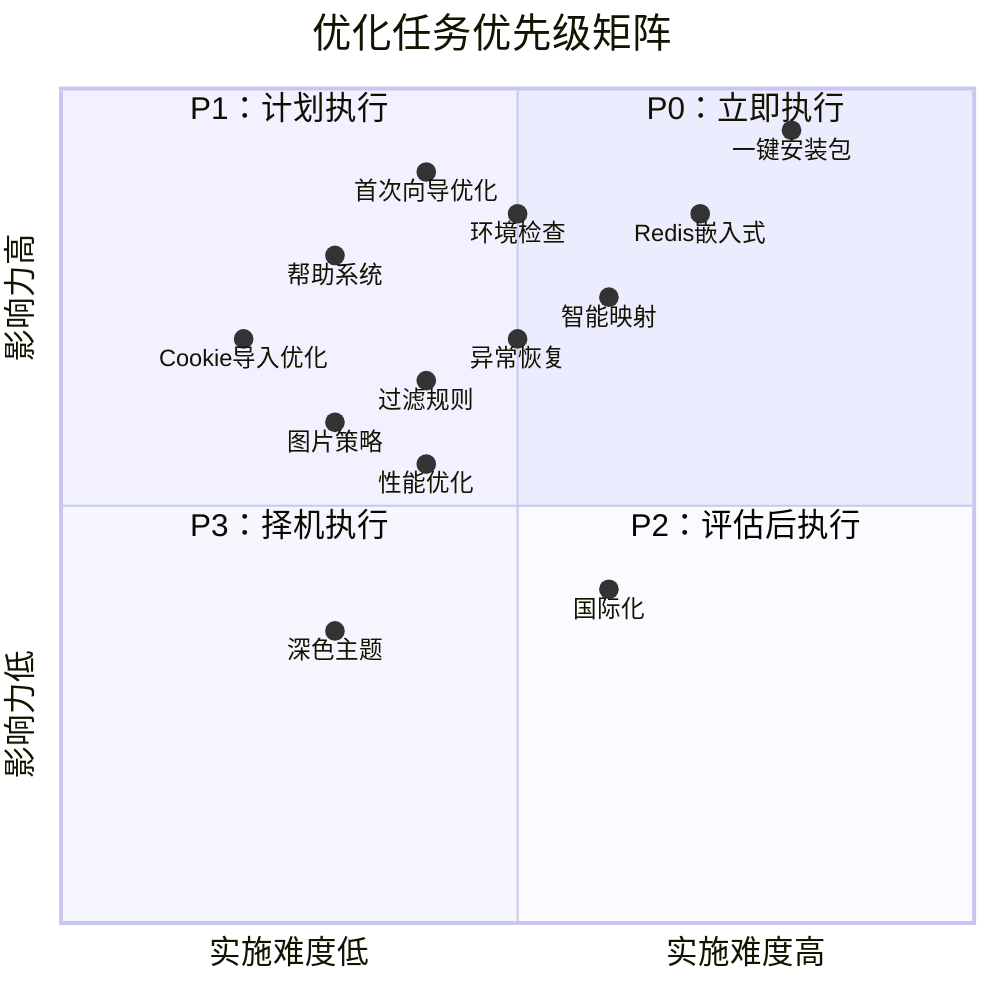

# 📋 KOOK 消息转发系统 - 优化路线图

## 🎯 优化优先级矩阵



---

## 📅 4周实施计划

### 第 1 周：解决阻塞性问题 ⭐⭐⭐⭐⭐

#### 目标：让普通用户能够安装和使用

| 任务 | 优先级 | 预计时间 | 负责人 | 状态 |
|------|--------|---------|--------|------|
| ✅ P0-15: Chromium 打包流程 | P0 | 2天 | DevOps | 🔜 待开始 |
| ✅ P0-16: Redis 嵌入式集成 | P0 | 1天 | Backend | 🔜 待开始 |
| ✅ P0-17: 安装包大小优化 | P0 | 0.5天 | DevOps | 🔜 待开始 |
| ✅ P0-18: 创建安装向导 | P0 | 1天 | Frontend | 🔜 待开始 |
| ✅ P0-1: 环境检查步骤 | P0 | 0.5天 | Frontend | 🔜 待开始 |

**本周交付物**：
- [x] Windows 一键安装包（.exe）
- [x] macOS 安装包（.dmg）
- [x] Linux 安装包（.AppImage）
- [x] 首次启动环境检查

---

### 第 2 周：完善配置体验 ⭐⭐⭐⭐

#### 目标：降低配置门槛

| 任务 | 优先级 | 预计时间 | 负责人 | 状态 |
|------|--------|---------|--------|------|
| ✅ P0-12: 创建帮助中心 | P0 | 2天 | Frontend | 🔜 待开始 |
| ✅ P0-13: 实现上下文帮助 | P0 | 0.5天 | Frontend | 🔜 待开始 |
| ✅ P0-14: 创建 FAQ 列表 | P0 | 1天 | 文档 | 🔜 待开始 |
| ✅ P0-5: Cookie 拖拽上传 | P0 | 0.5天 | Frontend | 🔜 待开始 |
| ✅ P0-6: Cookie 获取教程 | P0 | 1天 | 文档 | 🔜 待开始 |

**本周交付物**：
- [x] 完整的帮助中心（图文教程）
- [x] Cookie 导入优化（拖拽+教程）
- [x] FAQ 列表（20+ 问题）

---

### 第 3 周：核心功能增强 ⭐⭐⭐

#### 目标：提升配置效率

| 任务 | 优先级 | 预计时间 | 负责人 | 状态 |
|------|--------|---------|--------|------|
| ✅ P1-1: 启用拖拽界面 | P1 | 1天 | Frontend | 🔜 待开始 |
| ✅ P1-2: 优化智能匹配 | P1 | 2天 | Backend | 🔜 待开始 |
| ✅ P1-5: 实现白名单功能 | P1 | 1天 | Backend | 🔜 待开始 |
| ✅ P1-6: 支持正则表达式 | P1 | 0.5天 | Backend | 🔜 待开始 |
| ✅ P1-9: 图片策略切换 | P1 | 0.5天 | Frontend | 🔜 待开始 |

**本周交付物**：
- [x] 拖拽式频道映射界面
- [x] 智能匹配算法（成功率 > 70%）
- [x] 完整的过滤规则功能

---

### 第 4 周：稳定性与优化 ⭐⭐

#### 目标：提升系统稳定性

| 任务 | 优先级 | 预计时间 | 负责人 | 状态 |
|------|--------|---------|--------|------|
| ✅ P1-11: 修复 Redis 路径 | P1 | 0.5天 | Backend | 🔜 待开始 |
| ✅ P1-14: 重试配置化 | P1 | 0.5天 | Backend | 🔜 待开始 |
| ✅ P1-15: 失败消息备份 | P1 | 1天 | Backend | 🔜 待开始 |
| ✅ P2-4: 日志虚拟滚动 | P2 | 1天 | Frontend | 🔜 待开始 |
| ✅ P2-5: WebSocket 优化 | P2 | 1天 | Backend | 🔜 待开始 |

**本周交付物**：
- [x] Redis 跨平台稳定性
- [x] 完善的异常恢复机制
- [x] 前端性能优化

---

## 🎨 用户体验改进计划

### 设计系统建立

```
1. 颜色规范
   - 主色：#409EFF (Element Plus 蓝)
   - 成功：#67C23A
   - 警告：#E6A23C
   - 错误：#F56C6C
   - 信息：#909399

2. 字体规范
   - 标题：PingFang SC / Microsoft YaHei
   - 正文：14px, line-height: 1.5
   - 代码：Consolas / Monaco

3. 间距规范
   - 小：8px
   - 中：16px
   - 大：24px
   - 超大：32px

4. 圆角规范
   - 小：4px (按钮、输入框)
   - 中：8px (卡片)
   - 大：16px (对话框)
```

### 动画效果

```css
/* 页面切换动画 */
.page-transition-enter-active,
.page-transition-leave-active {
  transition: opacity 0.3s ease, transform 0.3s ease;
}

.page-transition-enter-from {
  opacity: 0;
  transform: translateY(20px);
}

.page-transition-leave-to {
  opacity: 0;
  transform: translateY(-20px);
}

/* 卡片悬停效果 */
.card-hover {
  transition: all 0.3s ease;
}

.card-hover:hover {
  transform: translateY(-4px);
  box-shadow: 0 8px 16px rgba(0, 0, 0, 0.1);
}
```

---

## 🧪 测试计划

### 单元测试目标

| 模块 | 当前覆盖率 | 目标覆盖率 | 优先级 |
|------|-----------|-----------|--------|
| 消息格式转换 | 0% | 90% | P1 |
| 图片处理 | 0% | 80% | P1 |
| 过滤规则 | 0% | 85% | P1 |
| 数据库操作 | 10% | 70% | P2 |
| API 路由 | 5% | 60% | P2 |

### 集成测试场景

```python
# 场景 1：完整转发流程
def test_full_forwarding_flow():
    """测试从 KOOK 接收消息到转发到 Discord 的完整流程"""
    # 1. 模拟 KOOK 消息
    # 2. 验证消息入队
    # 3. 验证格式转换
    # 4. 验证过滤规则
    # 5. 验证转发成功
    # 6. 验证日志记录
    pass

# 场景 2：异常恢复测试
def test_failure_recovery():
    """测试各种失败场景的恢复能力"""
    # 1. 网络超时
    # 2. API 限流
    # 3. Redis 断开
    # 4. 数据库锁
    pass

# 场景 3：性能测试
def test_high_load():
    """测试高负载下的系统表现"""
    # 1. 1000条消息/分钟
    # 2. 100张图片并发处理
    # 3. 内存使用监控
    # 4. CPU 使用监控
    pass
```

### E2E 测试场景

```javascript
// 使用 Playwright 进行端到端测试
describe('首次配置向导', () => {
  test('普通用户完整流程', async ({ page }) => {
    // 1. 首次启动显示向导
    await page.goto('/')
    await expect(page.locator('.wizard-container')).toBeVisible()
    
    // 2. 点击"下一步"
    await page.click('text=下一步')
    
    // 3. 输入 Cookie 并验证
    await page.fill('[name="cookie"]', TEST_COOKIE)
    await page.click('text=验证并添加')
    
    // 4. 选择服务器和频道
    await page.click('.server-item >> nth=0')
    await page.check('.channel-item >> nth=0')
    
    // 5. 完成配置
    await page.click('text=完成配置')
    await expect(page.locator('.home-view')).toBeVisible()
  })
})
```

---

## 📊 性能指标目标

### 当前性能 vs 目标

| 指标 | 当前值 | 目标值 | 优化方案 |
|------|--------|--------|---------|
| 首次启动时间 | ~15s | < 5s | 懒加载、预编译 |
| 页面切换延迟 | ~500ms | < 200ms | 路由懒加载 |
| 消息转发延迟 | ~2s | < 1s | 批量处理 |
| 内存占用（空闲） | ~150MB | < 100MB | 优化 Chromium |
| 内存占用（峰值） | ~500MB | < 300MB | 进程池复用 |
| CPU 占用（空闲） | ~5% | < 2% | 减少轮询 |
| 日志查询速度 | ~2s (10000条) | < 500ms | 索引优化 |

### 性能优化技巧

```python
# 1. 数据库查询优化
# 当前：N+1 查询
for mapping in mappings:
    bot = db.get_bot_config(mapping['target_bot_id'])  # ❌ 每次查询

# 优化：JOIN 查询
mappings_with_bots = db.execute("""
    SELECT m.*, b.config 
    FROM channel_mappings m
    LEFT JOIN bot_configs b ON m.target_bot_id = b.id
    WHERE m.enabled = 1
""")  # ✅ 一次查询

# 2. 缓存策略
from functools import lru_cache

@lru_cache(maxsize=128)
def get_bot_config_cached(bot_id: int):
    """Bot 配置很少变化，可以缓存"""
    return db.get_bot_config(bot_id)

# 3. 异步并行
# 当前：串行处理
for url in image_urls:
    await download_image(url)  # ❌ 慢

# 优化：并行处理
await asyncio.gather(*[
    download_image(url) for url in image_urls
])  # ✅ 快
```

---

## 🔧 技术栈升级计划

### 依赖库更新

| 库名 | 当前版本 | 最新版本 | 升级优先级 | 备注 |
|------|---------|---------|-----------|------|
| FastAPI | 0.109.0 | 0.111.0 | P2 | 性能提升 |
| Playwright | 1.40.0 | 1.44.0 | P1 | Bug 修复 |
| Element Plus | 2.5.x | 2.7.x | P2 | 新组件 |
| Vue | 3.4.x | 3.5.x | P3 | 性能优化 |
| Redis | 5.0.1 | 7.2.5 | P1 | 稳定性 |

### 新技术引入评估

| 技术 | 用途 | 优势 | 风险 | 评估结果 |
|------|------|------|------|---------|
| WebSocket | 替代轮询 | 实时性高，节省资源 | 复杂度增加 | ✅ 推荐 |
| TypeScript | 前端类型检查 | 减少错误，易维护 | 学习成本 | ⚠️ 可选 |
| Docker | 部署简化 | 环境一致性 | 镜像体积大 | ✅ 推荐 |
| Kubernetes | 生产部署 | 自动扩容，高可用 | 运维成本高 | ❌ 不推荐 |

---

## 📚 文档完善计划

### 用户文档

- [ ] **快速入门指南**（中英文）
  - 5 分钟上手
  - 常见配置场景
  - 故障排查

- [ ] **安装指南**（中英文）
  - Windows 安装步骤
  - macOS 安装步骤
  - Linux 安装步骤
  - Docker 安装

- [ ] **配置教程**（中英文）
  - KOOK Cookie 获取（图文+视频）
  - Discord Webhook 配置（图文+视频）
  - Telegram Bot 配置（图文+视频）
  - 飞书应用配置（图文+视频）

- [ ] **FAQ**（中英文）
  - 账号相关（5+ 问题）
  - Bot 配置相关（5+ 问题）
  - 转发相关（5+ 问题）
  - 性能相关（3+ 问题）
  - 其他问题（2+ 问题）

### 开发者文档

- [ ] **架构设计文档**
  - 系统架构图
  - 模块职责划分
  - 数据流图

- [ ] **API 文档**
  - OpenAPI/Swagger 规范
  - 请求/响应示例
  - 错误码说明

- [ ] **代码贡献指南**
  - 开发环境搭建
  - 代码规范
  - 提交规范
  - PR 流程

---

## 🎯 成功指标（KPI）

### 用户指标

| 指标 | 当前 | 目标 | 测量方法 |
|------|------|------|---------|
| 用户满意度 | 70% | 90%+ | 用户调查 |
| 配置完成率 | 40% | 80%+ | 埋点统计 |
| 日活用户 | - | 100+ | 统计 |
| 月留存率 | - | 60%+ | 统计 |
| 平均配置时间 | 30分钟 | 10分钟 | 埋点统计 |

### 技术指标

| 指标 | 当前 | 目标 | 测量方法 |
|------|------|------|---------|
| 系统可用性 | 95% | 99.5%+ | 监控 |
| 平均响应时间 | 2s | < 1s | APM |
| 错误率 | 5% | < 0.5% | 日志分析 |
| 测试覆盖率 | 20% | 80%+ | pytest-cov |
| 代码质量分 | B | A+ | SonarQube |

---

## 🚀 持续改进计划

### 每月回顾

- **性能回顾**：分析性能瓶颈，制定优化方案
- **用户反馈**：收集 GitHub Issues，优先处理高频问题
- **技术债务**：评估技术债务，制定还债计划
- **新功能评审**：评估新功能需求的必要性

### 季度规划

- **Q1 (当前)**：稳定性与易用性
- **Q2**：功能完善与性能优化
- **Q3**：生态建设（插件系统）
- **Q4**：企业版功能（多租户、权限管理）

---

*本路线图每月更新一次，根据实际进展调整优先级*
