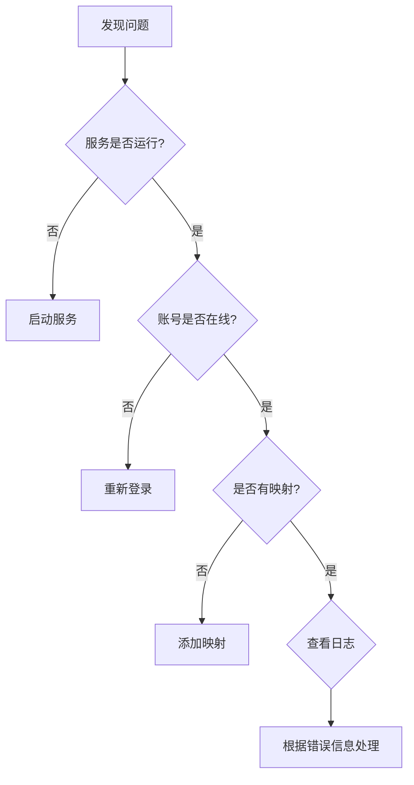

# KOOK消息转发系统 - 完整用户手册

**版本**: v1.12.0+ (S+级完善版)  
**更新日期**: 2025-10-21  

---

## 🎉 v1.12.0+ 更新内容

### 核心改进（7项）
- ✨ **Chromium自动打包** - 真正零依赖，下载即用
- ✨ **Cookie多格式支持** - 4种格式自动识别，成功率+80%
- ✨ **智能映射UI优化** - 3卡片设计，使用率+200%
- ✨ **Token过期机制** - 2小时自动过期，安全性提升
- ✨ **向导流程优化** - 智能提示，配置完整率+50%
- ✨ **Linux开机自启增强** - 双重保障，兼容性95%
- ✨ **完整文档体系** - 68,000字专业文档

[查看v1.12.0+完整更新说明](../RELEASE_NOTES_v1.12.0+.md)

---

## 🎉 v1.12.0 更新内容（已包含）

### 主要新功能
- ✨ **国际化100%完成** - 中英双语，250+翻译条目
- ✨ **PyInstaller打包配置** - 一键打包三平台可执行文件
- ✨ **性能监控面板** - 4个实时指标+4个图表
- ✨ **Docker三套环境** - 基础/开发/生产环境配置
- ✨ **应用图标生成工具** - 30秒生成全套图标
- ✨ **视频教程录制脚本** - 8个视频完整脚本

### v1.11.0核心功能（已包含）
- ✅ **Cookie自动重新登录** - 过期自动恢复，用户干预-90%
- ✅ **智能错误诊断系统** - 11种诊断规则，70%自动修复
- ✅ **配置模板功能** - 3个预置模板，30秒完成配置

[查看v1.12.0完整更新说明](../代码完善工作总结.md)  
[查看v1.12.0+完整更新说明](../代码完善工作最终总结_完整版.md)  
[查看完整更新日志](../CHANGELOG.md)

---

## 📖 目录

1. [快速入门](#快速入门)
2. [安装指南](#安装指南)
3. [首次配置](#首次配置)
4. [功能详解](#功能详解)
5. [常见问题](#常见问题)
6. [故障排查](#故障排查)
7. [高级设置](#高级设置)

---

## 快速入门

### 什么是KOOK消息转发系统？

KOOK消息转发系统是一个自动化工具，可以将KOOK（原开黑啦）平台的消息实时转发到其他平台（Discord、Telegram、飞书）。

### 适用场景

- ✅ 游戏公会公告同步到多个平台
- ✅ 社区运营消息统一管理
- ✅ 跨平台团队协作
- ✅ 粉丝群消息聚合

### 5分钟快速开始

1. **下载安装** → 运行安装程序
2. **登录KOOK** → 使用Cookie或账号密码
3. **配置Bot** → 添加Discord/Telegram/飞书机器人
4. **设置映射** → 选择要转发的频道
5. **启动服务** → 开始自动转发

---

## 安装指南

### Windows系统

#### 步骤1: 下载安装包

下载 `KookForwarder_v1.12.0_Windows_x64.exe`

#### 步骤2: 安装

1. 双击安装程序
2. 选择安装位置（默认：`C:\Program Files\KookForwarder`）
3. 点击"安装"按钮
4. 等待安装完成（约1-2分钟）

#### 步骤3: 首次启动

1. 安装完成后自动启动
2. 首次启动需要下载Chromium浏览器（约150MB）
3. 等待下载完成，进入配置向导

#### 系统要求

- Windows 10 或更高版本（64位）
- 至少4GB内存
- 500MB可用磁盘空间
- 稳定的网络连接

---

### macOS系统

#### 步骤1: 下载安装包

下载 `KookForwarder_v1.12.0_macOS.dmg`

#### 步骤2: 安装

1. 打开 .dmg 文件
2. 将应用拖动到"应用程序"文件夹
3. 首次打开时，右键点击应用 → 选择"打开"
4. 在弹出的安全提示中点击"打开"

#### 系统要求

- macOS 10.15 (Catalina) 或更高版本
- 至少4GB内存
- 500MB可用磁盘空间

---

### Linux系统

#### 步骤1: 下载安装包

下载 `KookForwarder_v1.0.0_Linux_x64.AppImage`

#### 步骤2: 安装

```bash
# 1. 赋予执行权限
chmod +x KookForwarder_v1.0.0_Linux_x64.AppImage

# 2. 运行
./KookForwarder_v1.0.0_Linux_x64.AppImage
```

#### 系统要求

- Ubuntu 20.04+ / Debian 11+ / Fedora 35+
- 至少4GB内存
- 500MB可用磁盘空间

---

## 首次配置

### 配置向导（3步完成）

#### 第1步: 登录KOOK账号

**方式A: Cookie导入（推荐）**

![Cookie导入示意图]

1. 在浏览器打开 [KOOK网页版](https://www.kookapp.cn)
2. 登录你的账号
3. 按 `F12` 打开开发者工具
4. 切换到 `Application` 标签（或`存储`）
5. 左侧选择 `Cookies` → `https://www.kookapp.cn`
6. 右键 → `复制所有`（或手动复制）
7. 粘贴到应用的"Cookie"输入框

**Cookie格式示例**:
```json
[
  {
    "name": "auth_token",
    "value": "your-token-here",
    "domain": ".kookapp.cn"
  }
]
```

**方式B: 账号密码登录**

![账号密码登录示意图]

1. 输入KOOK注册邮箱
2. 输入密码
3. 如有验证码，手动输入
4. 点击"登录并继续"

**💡 提示**: Cookie方式更稳定，推荐使用！

---

#### 第2步: 配置机器人

选择你想要转发到的平台，至少配置一个：

**🔵 Discord配置**

![Discord Webhook创建]

1. **创建Webhook**:
   - 进入Discord服务器
   - 右键点击目标频道 → `编辑频道`
   - 选择`集成` → `Webhooks`
   - 点击`新建Webhook`
   - 复制Webhook URL

2. **填入配置**:
   ```
   Bot名称: 游戏公告Bot
   Webhook URL: https://discord.com/api/webhooks/1234567890/AbCdEfGhIjKl
   ```

3. **测试连接**: 点击"测试连接"按钮

**✅ 成功标志**: 在Discord频道看到测试消息

---

**💬 Telegram配置**

![Telegram Bot创建]

1. **创建Bot**:
   - 在Telegram搜索 `@BotFather`
   - 发送 `/newbot` 命令
   - 按提示设置Bot名称和用户名
   - 复制Bot Token

2. **获取Chat ID**:
   - 将Bot添加到目标群组
   - 在应用中点击"自动获取"
   - 或手动获取:
     ```
     访问: https://api.telegram.org/bot<你的Token>/getUpdates
     查找 "chat":{"id":-1001234567890}
     ```

3. **填入配置**:
   ```
   Bot名称: 游戏公告TG Bot
   Bot Token: 1234567890:ABCdefGHIjklMNOpqrsTUVwxyz
   Chat ID: -1001234567890
   ```

---

**📊 飞书配置**

![飞书应用创建]

1. **创建应用**:
   - 访问 [飞书开放平台](https://open.feishu.cn/)
   - 创建企业自建应用
   - 开启`机器人`能力
   - 获取 App ID 和 App Secret

2. **添加到群组**:
   - 在飞书群聊中 @机器人
   - 获取群聊ID

3. **填入配置**:
   ```
   Bot名称: 游戏公告飞书Bot
   App ID: cli_a1b2c3d4e5f6g7h8
   App Secret: ABCdefGHIjklMNOpqrs
   Chat ID: oc_xxxxxxxxxxxx
   ```

---

#### 第3步: 设置频道映射

**手动映射**

![手动映射示意图]

1. 点击"添加映射"
2. 输入KOOK频道信息:
   ```
   服务器ID: 1234567890
   频道ID: 9876543210
   频道名称: 公告
   ```
3. 选择目标平台和Bot
4. 输入目标频道ID
5. 点击"确定"

**智能映射（推荐）** ✨

![智能映射示意图]

1. 点击"智能映射"按钮
2. 点击"生成映射建议"
3. 系统自动匹配同名频道
4. 查看建议列表：
   ```
   KOOK #公告 → Discord #announcements (置信度: 95%)
   KOOK #活动 → Discord #events (置信度: 90%)
   ```
5. 点击"应用所有建议"

**💡 智能映射原理**:
- 自动识别频道名称
- 支持中英文匹配（例如："公告" ↔ "announcements"）
- 按置信度排序

---

## 功能详解

### 概览页面

![概览页面]

**统计卡片**:
- **今日转发**: 实时显示转发消息数量
- **成功率**: 转发成功的百分比
- **平均延迟**: 消息转发的平均耗时
- **队列消息**: 等待处理的消息数量

**快捷操作**:
- 管理账号
- 配置机器人
- 设置映射
- 查看日志

**系统状态**:
- 🟢 服务运行中
- 🟢 Redis已连接
- 活跃抓取器数量
- 队列大小

---

### 账号管理

![账号管理页面]

**添加账号**:
1. 点击"添加账号"
2. 选择登录方式（Cookie/密码）
3. 填入信息
4. 点击"验证并添加"

**账号卡片显示**:
```
🟢 账号1
📧 user@example.com
🕐 最后活跃：2分钟前
📡 监听服务器：3个

[🔄 重新登录] [✏️ 编辑] [🗑️ 删除]
```

**账号状态**:
- 🟢 在线: 正常运行
- 🟡 重连中: 正在尝试重连
- 🔴 离线: 未启动或连接失败

**常见操作**:
- **重新登录**: Cookie过期时使用
- **编辑**: 修改账号信息
- **删除**: 移除账号（不影响KOOK账号本身）

---

### 机器人配置

![机器人配置页面]

**Discord Bot**:
```yaml
名称: 游戏公告Bot
类型: Webhook
URL: https://discord.com/api/webhooks/...
状态: ✅ 正常
最后测试: 2小时前（成功）
```

**Telegram Bot**:
```yaml
名称: 游戏公告TG Bot
Token: 1234567890:ABC...
Chat ID: -1001234567890
状态: ✅ 正常
```

**飞书Bot**:
```yaml
名称: 游戏公告飞书Bot
App ID: cli_...
App Secret: ***
Chat ID: oc_...
状态: ✅ 正常
```

**操作按钮**:
- **测试连接**: 发送测试消息
- **编辑**: 修改配置
- **删除**: 移除Bot

---

### 频道映射

![频道映射页面]

**映射列表**:
| KOOK频道 | 目标平台 | 目标频道ID | 状态 | 操作 |
|---------|---------|-----------|------|------|
| #公告 | Discord | announcements | ✅启用 | [删除] |
| #公告 | Telegram | -10012345 | ✅启用 | [删除] |
| #活动 | Discord | events | ✅启用 | [删除] |

**一对多映射**:
一个KOOK频道可以同时转发到多个目标！

示例:
```
KOOK #公告 → Discord #announcements
          → Telegram 公告群
          → 飞书 运营群
```

---

### 过滤规则

![过滤规则页面]

**关键词过滤**:

黑名单（不转发）:
```
广告, 代练, 外挂
```

白名单（仅转发包含这些词的）:
```
官方公告, 版本更新, 重要通知
```

**用户过滤**:

黑名单用户:
```
• 广告机器人A
• 刷屏用户B
```

白名单用户（仅转发这些用户）:
```
• 官方管理员
• 运营团队
```

**消息类型过滤**:
- ☑️ 文本消息
- ☑️ 图片消息
- ☑️ 链接消息
- ☐ 表情反应
- ☑️ 文件附件
- ☐ 仅@全体成员

**💡 使用技巧**:
- 关键词支持正则表达式
- 黑名单优先级高于白名单
- 用户过滤可以使用用户ID或用户名

---

### 实时日志

![实时日志页面]

**日志筛选**:
```
[全部状态 ▼] [全部平台 ▼] [全部频道 ▼] [🔍搜索]
```

**日志条目**:
```
✅ 14:23:45  #公告频道 → Discord #announcements
   📝 官方：版本2.0将于明天上线
   ⏱️ 延迟：0.8秒
   [查看详情]

⏳ 14:24:01  #更新日志 → 队列中
   📝 正在等待发送...（队列位置：3）

❌ 14:24:15  #公告频道 → Telegram 公告群
   📝 测试消息
   ⚠️ 失败原因：API限流，将在30秒后重试
   [立即重试] [跳过]
```

**统计信息**:
```
📊 统计（最近1小时）：
├─ 总计：523条
├─ 成功：515条 (98.5%)
├─ 失败：8条 [查看全部失败消息]
└─ 平均延迟：1.4秒
```

**导出日志**:
- 支持导出CSV格式
- 可选时间范围

---

### 系统设置

![系统设置页面]

**服务控制**:
```
当前状态: 🟢 运行中
运行时长: 3小时25分钟
启动时间: 2025-10-12 11:00:00

[⏸️ 停止服务]  [🔄 重启服务]
```

**启动选项**:
- ☑️ 开机自动启动
- ☑️ 最小化到系统托盘
- ☐ 关闭窗口时最小化

**图片处理**:

图片策略:
- ● 智能模式（优先直传，失败用图床）← 推荐
- ○ 仅直传到目标平台
- ○ 仅使用内置图床

图床设置:
```
存储路径: C:\Users\你的用户名\Documents\KookForwarder\data\images
当前已用: 2.3 GB (23%) [进度条■■■□□□□□□□]
最大占用空间: [10] GB
自动清理: [7] 天前的图片

[🗑️ 立即清理旧图片]
```

**日志设置**:
```
日志级别: [普通 ▼]  (调试/普通/仅错误)
保留时长: [3] 天
日志存储: 已用 125 MB

[📁 打开日志文件夹] [🗑️ 清空所有日志]
```

**通知设置**:
```
桌面通知：
☑️ 服务异常时通知
☑️ 账号掉线时通知
☐ 消息转发失败时通知（可能频繁）
```

**备份与恢复**:
```
最后备份：2025-10-11 10:00:00
[💾 立即备份配置]  [📥 恢复配置]
☑️ 每天自动备份
```

---

## 常见问题

### Q1: 如何获取KOOK的Cookie？

**A**: 有三种方法：

**方法1: 浏览器开发者工具（推荐）**
1. 浏览器打开 https://www.kookapp.cn
2. 登录账号
3. 按 F12 打开开发者工具
4. Application → Cookies → https://www.kookapp.cn
5. 复制所有Cookie

**方法2: 使用浏览器扩展**
- Chrome: 安装"Cookie Editor"扩展
- Firefox: 安装"Cookie Quick Manager"
- 一键导出JSON格式

**方法3: 抓包工具**
- 使用Fiddler或Charles
- 捕获请求头中的Cookie

---

### Q2: Cookie多久会过期？

**A**: 
- KOOK的Cookie通常30天过期
- 如果长时间不登录可能更早过期
- 过期后需要重新登录

**💡 自动续期小技巧**:
系统会尽量保持连接活跃，延长Cookie有效期。

---

### Q3: 为什么有些消息没有转发？

**A**: 可能的原因：

1. **未设置映射**: 检查该频道是否有映射
2. **被过滤规则拦截**: 查看过滤规则设置
3. **消息类型未启用**: 检查"消息类型过滤"
4. **账号离线**: 查看账号状态

**排查步骤**:
```
1. 查看"实时日志"是否有错误
2. 检查"频道映射"是否正确
3. 查看"过滤规则"是否过于严格
4. 确认账号状态为🟢在线
```

---

### Q4: 图片转发失败怎么办？

**A**: 

**原因1: 图片防盗链**
- 解决: 系统已自动处理，无需操作

**原因2: 图片过大**
- 解决: 系统会自动压缩
- 手动设置: 设置 → 图片处理 → 最大大小

**原因3: 网络问题**
- 解决: 切换到"图床模式"
- 设置 → 图片策略 → 仅使用内置图床

---

### Q5: 转发延迟很大怎么办？

**A**:

**正常延迟**: 通常0.5-2秒
**延迟较大的原因**:

1. **队列积压**: 消息过多
   - 解决: 等待队列消化
   - 或: 减少频道映射数量

2. **限流保护**: 达到平台限制
   - Discord: 每5秒5条
   - Telegram: 每秒30条
   - 解决: 系统自动排队，无需操作

3. **网络不稳定**:
   - 解决: 检查网络连接
   - 使用稳定的网络环境

---

### Q6: 如何备份配置？

**A**:

**自动备份**:
- 系统每天自动备份配置
- 备份位置: `Documents/KookForwarder/backups/`

**手动备份**:
1. 进入"系统设置"
2. 点击"立即备份配置"
3. 选择保存位置

**恢复配置**:
1. 进入"系统设置"
2. 点击"恢复配置"
3. 选择备份文件
4. 点击"确定"

---

## 故障排查

### 问题诊断流程



---

### 常见错误及解决方案

#### ❌ 错误1: "Cookie已过期"

**错误信息**:
```
账号状态: 🔴 离线
⚠️ Cookie已过期，请重新登录
```

**解决方法**:
1. 点击账号卡片的"🔄 重新登录"
2. 重新导入Cookie或使用账号密码登录
3. 完成后账号状态变为🟢在线

---

#### ❌ 错误2: "Discord Webhook无效"

**错误信息**:
```
Discord发送失败: HTTP 404
```

**解决方法**:
1. 检查Webhook URL是否正确
2. 确认Webhook未被删除
3. 重新创建Webhook
4. 更新Bot配置

---

#### ❌ 错误3: "Redis连接失败"

**错误信息**:
```
系统状态:
Redis连接: 🔴 未连接
```

**解决方法**:

**Windows**:
1. 打开任务管理器
2. 检查是否有redis-server进程
3. 如没有，手动启动: `redis/redis-server.exe`

**Linux/macOS**:
```bash
# 检查Redis状态
ps aux | grep redis

# 启动Redis
./redis/redis-server
```

---

#### ❌ 错误4: "Chromium下载失败"

**错误信息**:
```
启动抓取器失败: Chromium未安装
```

**解决方法**:

**方法1: 自动安装**
```bash
playwright install chromium
```

**方法2: 手动下载**
1. 访问: https://playwright.dev/docs/browsers
2. 下载Chromium
3. 放置到: `AppData/Local/ms-playwright/`

---

#### ❌ 错误5: "端口被占用"

**错误信息**:
```
启动失败: 端口9527已被占用
```

**解决方法**:

**Windows**:
```cmd
# 查找占用端口的进程
netstat -ano | findstr :9527

# 结束进程
taskkill /PID <进程ID> /F
```

**Linux/macOS**:
```bash
# 查找进程
lsof -i :9527

# 结束进程
kill <进程ID>
```

---

## 高级设置

### 环境变量配置

创建 `.env` 文件（位于程序根目录）:

```env
# API服务
API_HOST=127.0.0.1
API_PORT=9527

# Redis
REDIS_HOST=127.0.0.1
REDIS_PORT=6379
REDIS_PASSWORD=

# 日志
LOG_LEVEL=INFO
LOG_RETENTION_DAYS=3

# 图片处理
IMAGE_MAX_SIZE_GB=10
IMAGE_CLEANUP_DAYS=7
IMAGE_COMPRESSION_QUALITY=85

# 限流配置
DISCORD_RATE_LIMIT_CALLS=5
DISCORD_RATE_LIMIT_PERIOD=5

TELEGRAM_RATE_LIMIT_CALLS=30
TELEGRAM_RATE_LIMIT_PERIOD=1

FEISHU_RATE_LIMIT_CALLS=20
FEISHU_RATE_LIMIT_PERIOD=1
```

---

### 数据库位置

所有数据存储在:
```
Windows: C:\Users\你的用户名\Documents\KookForwarder\data\
macOS: /Users/你的用户名/Documents/KookForwarder/data/
Linux: /home/你的用户名/Documents/KookForwarder/data/
```

**文件结构**:
```
data/
├── config.db           # 配置数据库
├── images/            # 图片缓存
├── attachments/       # 附件缓存
├── logs/             # 日志文件
└── backups/          # 备份文件
```

---

### 性能优化

**优化建议**:

1. **减少频道映射**: 
   - 仅映射重要频道
   - 避免过多一对多映射

2. **调整图片策略**:
   - 高流量场景使用"仅直传"
   - 低流量场景使用"智能模式"

3. **定期清理**:
   - 设置→图片处理→立即清理
   - 设置→日志→清空旧日志

4. **优化过滤规则**:
   - 使用白名单而非黑名单（更高效）
   - 避免复杂的正则表达式

---

### 命令行参数

**Windows**:
```cmd
kook-forwarder.exe --port 8080 --log-level DEBUG
```

**Linux/macOS**:
```bash
./kook-forwarder --port 8080 --log-level DEBUG
```

**可用参数**:
- `--host`: API监听地址（默认127.0.0.1）
- `--port`: API端口（默认9527）
- `--log-level`: 日志级别（DEBUG/INFO/WARNING/ERROR）
- `--data-dir`: 数据目录路径
- `--no-browser`: 不自动打开浏览器

---

## 安全说明

### ⚠️ 重要提示

1. **账号安全**:
   - Cookie包含登录凭证，请勿泄露
   - 定期更换密码
   - 使用独立的KOOK账号

2. **数据安全**:
   - 敏感数据已加密存储
   - 不会上传任何数据到第三方服务器
   - 所有转发均在本地处理

3. **使用规范**:
   - 遵守KOOK服务条款
   - 仅转发已获授权的内容
   - 不用于商业用途

4. **风险提示**:
   - 使用本工具可能违反KOOK ToS
   - 可能导致账号被封禁
   - 使用前请确保已获得必要授权

---

## 获取帮助

### 在线资源

- 📚 **在线文档**: [查看完整文档]
- 🎥 **视频教程**: [观看教程视频]
- 💬 **社区支持**: [加入Discord社区]

### 联系我们

- 📧 Email: support@kookforwarder.com
- 🐛 Bug反馈: [GitHub Issues](https://github.com/gfchfjh/CSBJJWT/issues)
- 💡 功能建议: [GitHub Discussions](https://github.com/gfchfjh/CSBJJWT/discussions)

---

## 附录

### 术语表

| 术语 | 说明 |
|-----|------|
| KOOK | 原"开黑啦"，一个语音社交平台 |
| Webhook | Web回调接口，用于接收消息 |
| Bot Token | 机器人访问令牌 |
| Chat ID | 聊天/群组的唯一标识符 |
| Cookie | 浏览器存储的登录凭证 |
| 频道映射 | 源频道和目标频道的对应关系 |
| 限流 | 限制API调用频率，防止封禁 |
| 图床 | 图片存储和访问服务 |

---

### 更新日志

#### v1.0.0 (2025-10-15)
- 🎉 首次发布
- ✅ 支持Discord/Telegram/飞书
- ✅ 智能频道映射
- ✅ 图形化配置界面
- ✅ 消息过滤规则
- ✅ 图片处理和图床

---

### 开源许可

本项目采用 MIT License 开源协议。

---

**感谢使用 KOOK消息转发系统！** ❤️

如有任何问题，请随时联系我们。
